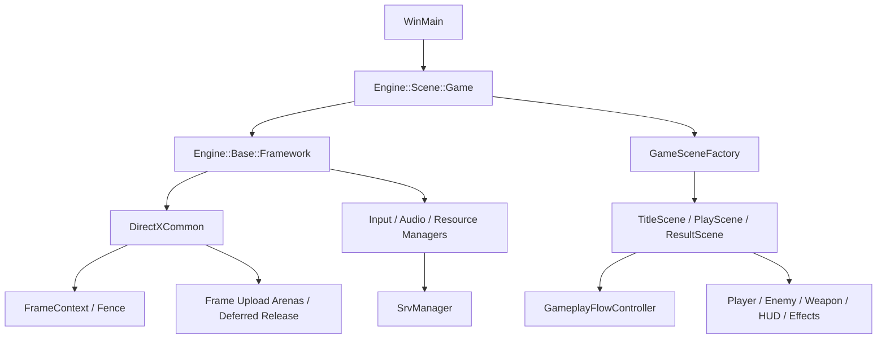

# Octopus

`Octopus` は、敵を倒して経験値を集め、レベルアップで武器や能力を選びながら 5 分後のボス撃破を目指す 3D サバイバルシューティングです。

ゲーム本体に加え、描画・入力・音声・モデル・リソース管理を行う Windows / DirectX 12 向けゲームエンジンを C++20 で実装しています。

## 提出物

企業提出用の成果物は、リポジトリ外の以下に整理しています。

- `C:\Users\k023g\source\repos\Octopus\ソースファイル`
- `C:\Users\k023g\source\repos\Octopus\実行ファイル`
- `C:\Users\k023g\source\repos\Octopus\Octopus_Source.zip`
- `C:\Users\k023g\source\repos\Octopus\Octopus_Executable.zip`

提出時点を固定する Git タグは `submission-octopus-2026-08-09` です。企業へリンクを送る場合は、このタグから GitHub Release を作成し、上記 2 つの zip を Release assets として添付する方法が最も分かりやすいです。

## ゲームの流れ

1. 移動と回避で敵との距離を調整する
2. 自動攻撃で敵を倒し、経験値オーブを回収する
3. レベルアップ時に 3 つの候補から強化を選ぶ
4. 武器と能力を組み合わせて戦い方を作る
5. 5 分後に出現するボスを倒す
6. 獲得したポイントをショップで次回の強化に使う

## ゲームの特徴

### 武器と成長

- 通常弾: 照準方向へ発射する基本武器
- 旋回弾: プレイヤーの周囲を回って接触した敵を攻撃
- 近接・投射系武器: ソード、弓、岩、骨、ブーメランなど
- 属性・補助武器: 雷、炎、オーラ、拳銃など
- 能力強化: 攻撃力、最大 HP、移動速度、回復、取得範囲など

`LevelUpChoiceService` が現在のプレイヤー状態から候補を生成し、取得上限に達した強化を候補から除外します。

### ゲーム進行

`GameplayFlowController` で以下の状態を管理しています。

```text
Start -> Playing -> BossIntro -> Boss -> BossDefeated
           |          |            |
           v          v            v
        LevelUp     Paused        Dead
```

レベルアップやポーズ中は戦闘更新を止め、復帰後に元の進行へ戻します。

### データによる調整

武器、敵、出現設定、レベルアップ抽選、UI 配置を `Resources/DirectXGame/data` 以下の CSV へ分離しています。バランス調整や UI 位置の変更時に、コード中の固定値を編集する範囲を減らしています。

主なデータ:

- `playerStatus.csv`
- `characterStats.csv`
- `weaponUpgradeSettings.csv`
- `weaponUpgradePackages.csv`
- `enemyTypes.csv`
- `enemySpawnSettings.csv`
- `levelupWeights.csv`
- `ui_layout_*.csv`
- `debug_tuning.csv`
- `resource_manifest.csv`

`collision_telemetry.csv` や `soft_cap_telemetry.csv` などの計測ログは提出用 Git から除外しています。

## 操作方法

| 操作 | キーボード | マウス | ゲームパッド |
| --- | --- | --- | --- |
| 移動 | `WASD` / 矢印キー | 左クリック長押しで照準方向へ前進 | 左スティック / D-pad |
| 照準 | マウス照準と併用 | カーソル方向 | 右スティック |
| 回避 | `Space` | 右クリック | `B` |
| メニュー移動 | `WASD` / 矢印キー | ホバー | 左スティック / D-pad |
| 決定 | `Enter` / `Space` | 左クリック | `A` |
| キャンセル / 戻る | `Esc` | 右クリック | `B` |
| ポーズ | `Esc` / `P` | 中クリック | `Start` / `Back` |
| リザルト送り / タイトルへ戻る | `Enter` / `Space` / `Esc` | 左クリック / 右クリック | `A` / `B` |

UI 操作は、タイトル、ショップ、キャラクター選択、レベルアップ、ポーズ、リザルトで共通化しています。ImGui がキーボードまたはマウスを使用している間は、ゲーム側への入力を抑止します。

## 技術構成

| 項目 | 内容 |
| --- | --- |
| 言語 | C++20 / HLSL |
| 描画 API | DirectX 12 |
| 開発環境 | Visual Studio 2022 / MSVC v143 |
| 対応環境 | Windows 10 / 11 x64 |
| モデル・画像 | Assimp / DirectXTex |
| デバッグ UI | Dear ImGui / ImGuizmo / ImPlot |

## ディレクトリ構成

- `engine/`: 描画、入力、音声、モデル、パーティクル、カメラ、シーン基盤
- `game/directxgame/`: シーン、プレイヤー、敵、武器、HUD、演出、ゲームデータ
- `Resources/DirectXGame/`: ゲーム固有のモデル、テクスチャ、音声、UI、CSV
- `Resources/Shaders/`: エンジン側の HLSL シェーダ
- `externals/`: Assimp、DirectXTex、Dear ImGui などの外部ライブラリ
- `tests/`: CPU 回帰テスト用 Visual Studio プロジェクト
- `tools/`: CPU 回帰テスト実装と実行スクリプト

提出用ソースからは、`output/`、`tmp/`、`docs/`、`scripts/`、`.vs/`、`.codex/`、資料生成用 tools、計測ログ、個人用設定ファイルを除外しています。

## アーキテクチャ



`main.cpp` は起動と `GameSceneFactory` の注入に絞り、`PlayScene` をゲームプレイの構成地点としています。プレイヤー、敵、HUD、演出、状態遷移の処理はそれぞれのモジュールへ分割しています。

### DirectX 12 のリソース管理

- 2 個の `FrameContext` で CPU/GPU のフレーム境界を管理
- フレーム再利用時に対応する Fence だけを待機
- 動的 CBV/VBV/IBV をフレーム単位の Upload Arena へ配置
- 一時 GPU リソースを Fence 完了後に遅延解放
- Shader-visible SRV Heap を `SrvManager` へ集約
- SRV 使用数と High-watermark をデバッグ表示で確認

### 敵・弾が増える場面への対応

- 空間マップから近傍の衝突候補を抽出
- 弾オブジェクトをプールして再利用
- Swap-pop で削除時の要素移動を抑制
- 経験値オーブと通常弾に稼働上限を設定
- 稼働数と上限到達をデバッグ情報として確認

## ビルド

Developer PowerShell for Visual Studio で、この `README.md` がある `project` ディレクトリをカレントディレクトリにして実行します。

```powershell
msbuild KuboEngine.sln /m /p:Configuration=Debug /p:Platform=x64
msbuild KuboEngine.sln /m /p:Configuration=Release /p:Platform=x64
```

出力先:

- Debug: `..\generated\outputs\Debug\Octopus.exe`
- Release: `..\generated\outputs\Release\Octopus.exe`
- CPU テスト: `generated\outputs\tests\<Configuration>\cpu_regression_checks.exe`

Release ビルド後、`dxcompiler.dll`、`dxil.dll`、`Resources` は PostBuildEvent で実行ファイル出力先へコピーされます。Release では `.lib`、`.pdb`、`.ilk` は出力先から削除します。

## 実行

リソースパスはカレントディレクトリ基準です。通常は `project` ディレクトリから起動してください。

```powershell
& ..\generated\outputs\Release\Octopus.exe
```

企業提出用にまとめた実行ファイルは以下です。

```powershell
& "C:\Users\k023g\source\repos\Octopus\実行ファイル\Octopus.exe"
```

## テスト

```powershell
.\tools\run_cpu_regression_checks.ps1
```

CPU 回帰テストでは、空間セルキー、HP・ゲージ境界値、CSV の厳密解析、武器発射間隔、Run Seed、`SoundHandle` の契約を確認します。

## 確認済みの状態

2026-08-09 時点:

- Release x64 ビルド: PASS
- 出力 exe 名: `Octopus.exe`
- ウィンドウタイトル: `Octopus`
- 提出用 `Octopus_Source.zip` 作成済み
- 提出用 `Octopus_Executable.zip` 作成済み
- 提出用 Git タグ: `submission-octopus-2026-08-09`

## 既知の制約

- Windows / DirectX 12 専用
- FPS、GPU Pass 時間、Draw Call 内訳は未計測
- Shadow Pass のシルエット確認と GPU 時間計測は未実施
- 起動後に追加されたモデルは、モデルパス索引を再構築するまで自動検出されない
- 一部の旧サンプルリソースは保管しているが、ゲーム本編では `Resources/DirectXGame` を中心に使用している
