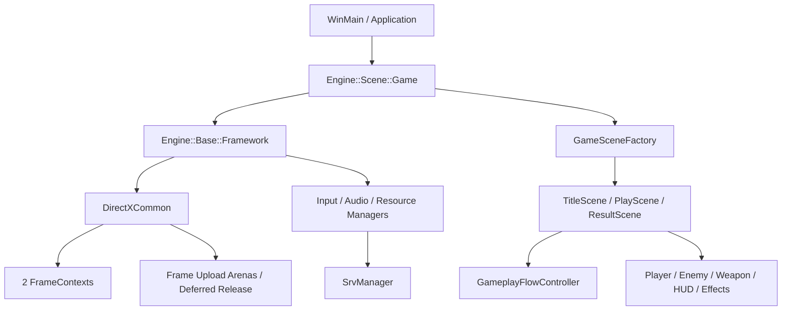

# Octopus — KuboEngine / DirectXGame

`Octopus`は、敵を倒して経験値を集め、レベルアップで武器や能力を選びながら5分後のボス撃破を目指す3Dサバイバルシューティングです。

ゲーム本体に加え、描画・入力・音声・リソース管理を行うWindows / DirectX 12向けゲームエンジンをC++20で実装しています。

## プレイ動画

[作品紹介動画（MP4）](output/video/Octopus_showcase_20260706.mp4)


## ゲームの流れ

1. 移動と回避で敵との距離を調整する
2. 自動攻撃で敵を倒し、経験値オーブを回収する
3. レベルアップ時に3つの候補から強化を選ぶ
4. 武器と能力を組み合わせて戦い方を作る
5. 5分後に出現するボスを倒す
6. 獲得したポイントをショップで次回の強化に使う

## ゲームの特徴

### 武器と成長

- 通常弾：照準方向へ発射する基本武器
- 旋回弾：プレイヤーの周囲を回って接触した敵を攻撃
- ドローン：プレイヤーを追従して攻撃を補助
- 雷：離れた敵を選んで攻撃
- 能力強化：攻撃力、最大HP、移動速度、回復など

`LevelUpChoiceService`が現在のプレイヤー状態から候補を生成し、取得上限に達した強化を候補から除外します。

### ゲーム進行

`GameplayFlowController`で以下の状態を明示的に管理しています。

```text
Start → Playing → BossIntro → Boss → BossDefeated
           ├── LevelUp
           ├── Paused
           └── Dead
```

レベルアップやポーズ中は戦闘更新を止め、復帰後に元の進行へ戻します。

### データによる調整

武器、敵、出現設定、レベルアップ抽選、UI配置を`Resources/DirectXGame/data`以下のCSVへ分離しています。バランス調整やUI位置の変更時に、コード中の固定値を編集する範囲を減らしています。

主なデータ:

- `weaponUpgradeSettings.csv`
- `enemyTypes.csv`
- `enemySpawnSettings.csv`
- `levelupWeights.csv`
- `playerStatus.csv`
- `ui_layout_*.csv`

## 操作方法

| 操作 | キーボード | マウス | ゲームパッド |
| --- | --- | --- | --- |
| 移動 | `WASD` / 矢印キー | 左クリック長押しで照準方向へ前進 | 左スティック / D-pad |
| 照準 | マウス照準と併用 | カーソル方向 | 右スティック |
| 回避 | `Space` | 右クリック | `B` |
| メニュー移動 | `WASD` / 矢印キー | ホバー | 左スティック / D-pad |
| 決定 | `Enter` / `Space` | 左クリック | `A` |
| キャンセル / 戻る | `Esc` | 右クリック | `B` |
| ポーズ | `Esc` / `P` | 中クリック | `Start` / `Back` |
| リザルト送り / タイトルへ戻る | `Enter` / `Space` / `Esc` | 左クリック / 右クリック | `A` / `B` |

UI操作は以下の画面で共通化しています。

| UI画面 | キーボード | マウス | ゲームパッド |
| --- | --- | --- | --- |
| タイトルメニュー | `WASD` / 矢印で選択、`Enter` / `Space`で決定 | ホバーで選択、左クリックで決定 | 左スティック / D-padで選択、`A`で決定 |
| ショップ / キャラクター購入 | `WASD` / 矢印で選択、`Enter` / `Space`で購入・選択、`Esc`で戻る | ホバーで選択、左クリックで購入・選択、右クリックで戻る | 左スティック / D-padで選択、`A`で購入・選択、`B`で戻る |
| 開始キャラクター選択 | `WASD` / 矢印または`1`-`3`で選択、`Enter` / `Space`で決定、`Esc`で戻る | ホバーで選択、左クリックで選択・決定、右クリックで戻る | 左スティック / D-padで選択、`A`で決定、`B`で戻る |
| レベルアップ選択 | `WASD` / 矢印で選択、`Enter` / `Space`で決定 | ホバーで選択、左クリックで決定 | 左スティック / D-padで選択、`A`で決定 |
| ポーズメニュー | `WASD` / 矢印で選択、`Enter` / `Space`で決定、`Esc`で再開 | ホバーで選択、左クリックで決定、右クリックで再開 | 左スティック / D-padで選択、`A`で決定、`B`で再開 |
| リザルト | `Enter` / `Space` / `Esc` | 左クリック / 右クリック | `A` / `B` |

ImGuiがキーボードまたはマウスを使用している間は、ゲーム側への入力を抑止します。

## 技術構成

| 項目 | 内容 |
| --- | --- |
| 言語 | C++20 / HLSL |
| 描画API | DirectX 12 |
| 開発環境 | Visual Studio 2022 / MSVC v143 |
| 対応環境 | Windows 10 / 11 x64 |
| モデル・画像 | Assimp / DirectXTex |
| デバッグUI | Dear ImGui / ImGuizmo / ImPlot |

## アーキテクチャ

共通機能とゲーム固有処理を分離しています。

- `engine/`：描画、入力、音声、モデル、パーティクル、カメラ、シーン基盤
- `game/directxgame/`：シーン、プレイヤー、敵、武器、HUD、演出、ゲームデータ
- `Resources/DirectXGame/`：モデル、テクスチャ、音声、UI、CSV
- `tests/`：CPU回帰テスト
- `tools/`：回帰テスト、シーン遷移ストレス、PIX事前確認



`main.cpp`は起動と`GameSceneFactory`の注入に絞り、`PlayScene`をゲームプレイの構成地点としています。プレイヤー、敵、HUD、演出、状態遷移の処理はそれぞれのモジュールへ分割しています。

### DirectX 12のリソース管理

- 2個の`FrameContext`でCPU/GPUのフレーム境界を管理
- フレーム再利用時に対応するFenceだけを待機
- 動的CBV/VBV/IBVをフレーム単位のUpload Arenaへ配置
- 一時GPUリソースをFence完了後に遅延解放
- Shader-visible SRV Heapを`SrvManager`へ集約
- SRV使用数とHigh-watermarkをテレメトリで確認

これはリソース寿命と同期条件を明示するための設計です。FPSやGPU処理時間の改善値は、PIXによる定量計測を行っていないため記載していません。

### 敵・弾が増える場面への対応

- 空間マップから近傍の衝突候補を抽出
- 弾オブジェクトをプールして再利用
- Swap-popで削除時の要素移動を抑制
- 経験値オーブと通常弾に稼働上限を設定
- 稼働数と上限到達をテレメトリへ出力

## ビルド

Developer PowerShell for Visual Studioで、`README.md`があるディレクトリをカレントディレクトリにして実行します。

```powershell
msbuild KuboEngine.sln /m /p:Configuration=Debug /p:Platform=x64
msbuild KuboEngine.sln /m /p:Configuration=Release /p:Platform=x64
```

出力先:

- Debug：`..\generated\outputs\Debug\KuboEngine.exe`
- Release：`..\generated\outputs\Release\KuboEngine.exe`
- CPUテスト：`generated\outputs\tests\<Configuration>\cpu_regression_checks.exe`

## 実行

リソースパスはカレントディレクトリ基準です。必ずプロジェクトディレクトリから起動してください。

```powershell
& ..\generated\outputs\Debug\KuboEngine.exe
```

Release版:

```powershell
& ..\generated\outputs\Release\KuboEngine.exe
```

## テスト

```powershell
.\tools\run_cpu_regression_checks.ps1
.\tools\run_scene_transition_stress.ps1 -Cycles 3 -TimeoutSeconds 120
.\tools\run_pix_capture_preflight.ps1
```

CPU回帰テストでは、空間セルキー、HP・ゲージ境界値、CSVの厳密解析、武器発射間隔、Run Seed、`SoundHandle`の契約を確認します。

シーン遷移ストレスではTitle → Gameplay → Resultを自動遷移し、訪問回数とSRV使用量を`generated/outputs/scene_transition_stress.txt`へ出力します。

## 確認済みの状態

2026-06-19時点:

- Debug x64ビルド：PASS
- Release x64ビルド：PASS
- Debug / Release CPUテスト：PASS
- シーン遷移ストレス3周：PASS
- Title / Gameplay / Result訪問数：3 / 3 / 3
- SRV最大使用数 / High-watermark：105 / 105
- 既存10周ストレス：PASS

## 既知の制約

- Windows / DirectX 12専用
- FPS、GPU Pass時間、Draw Call内訳は未計測
- Shadow Passのシルエット確認とGPU時間計測は未実施
- 起動後に追加されたモデルは、モデルパス索引を再構築するまで自動検出されない
- 一部の旧サンプルソースは保管しているが、Visual Studioのビルド対象外

## 関連資料

- [ゲームプレイクラス図](docs/directxgame_class_diagram.md)
- [詳細UML](docs/directxgame_uml_class_diagram.md)
- [Frame Resource設計](docs/frame_resource_design.md)
- [コードレビュー項目](docs/code_review_inventory.md)
- [プログラム説明資料](output/pdf/program_explanation_A4_2026.pdf)
