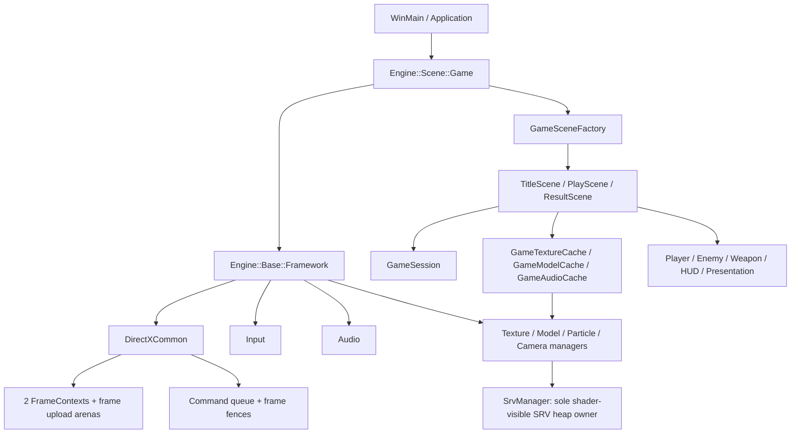

# KuboEngine / DirectXGame

Windows / DirectX 12向けのC++20ゲームエンジンと、タイトル・ゲームプレイ・リザルトで構成したアクションゲームです。描画、入力、音声、リソース管理をengine層に置き、ゲーム固有のscene、敵、武器、HUD、演出を`game/directxgame`へ分離しています。

## 動作環境

- Windows 10/11 x64
- DirectX 12対応GPU
- Visual Studio C++ Desktop workload
- Windows 10 SDK
- MSVC Platform Toolset v143

依存ライブラリは`externals`以下と`Lib`に配置済みです。主な依存はDirectXTex、Assimp、Dear ImGui、ImGuizmo、ImPlot、imgui-node-editorです。

## Build

Developer PowerShell for Visual Studioで、このREADMEがあるdirectoryをcurrent directoryにして実行します。

```powershell
msbuild KuboEngine.sln /m /p:Configuration=Debug /p:Platform=x64
msbuild KuboEngine.sln /m /p:Configuration=Release /p:Platform=x64
```

出力先:

- Debug: `..\generated\outputs\Debug\KuboEngine.exe`
- Release: `..\generated\outputs\Release\KuboEngine.exe`
- CPU tests: `generated\outputs\tests\<Configuration>\cpu_regression_checks.exe`

## Run

resource pathはcurrent directory基準です。project directoryから起動します。

```powershell
& ..\generated\outputs\Debug\KuboEngine.exe
```

## 操作

| 操作 | Keyboard / Mouse | Gamepad |
| --- | --- | --- |
| 移動 | `WASD` / Arrow keys | Left stick / D-pad |
| 照準 | Mouse | Right stick |
| 回避 | `Space` | `B` |
| Menu移動 | `WASD` / Arrow keys | D-pad |
| 決定 | `Enter` / `Space` / Left click | `A` |
| Cancel | `Esc` / Right click | `B` |
| Pause | `Esc` / `P` | `Start` / `Back` |

ImGuiがkeyboardまたはmouseをcaptureしている間、gameplay入力は抑止されます。

## Architecture



主要な設計契約:

- CPU/GPU overlapは2個の`FrameContext`で管理し、frame再利用時だけFenceを待ちます。
- 動的CBV/VBV/IBVはframe upload arenaへ配置します。
- static geometryはDEFAULT heapへ置き、staging resourceはframe Fence完了後に解放します。
- gameplay textureはscene単位でbatch preloadします。単体dynamic uploadもGPU全完了待ちを行いません。
- SRV heap、capacity、descriptor handleは`SrvManager`が単独所有します。
- model pathは初回作成するcanonical indexで解決し、同一scopeの重複名を例外にします。
- audio handleはstrong型のprocess-lifetime IDです。invalid handle操作はno-op、load/decode失敗は例外です。

詳細:

- [Gameplay class diagram](docs/directxgame_class_diagram.md)
- [Detailed gameplay UML](docs/directxgame_uml_class_diagram.md)
- [Frame resource design](docs/frame_resource_design.md)
- [Code review inventory](docs/code_review_inventory.md)

## Tests

正式CPU test projectはsolutionの`KuboEngineCpuTests`です。cell key、gauge境界値、CSV strict parsing、weapon interval、run seed、audio handle契約をproduction codeへ直接実行します。

```powershell
.\tools\run_cpu_regression_checks.ps1
.\tools\run_scene_transition_stress.ps1 -Cycles 3 -TimeoutSeconds 120
.\tools\run_pix_capture_preflight.ps1
```

scene stressは環境変数`KUBO_SCENE_STRESS_CYCLES`を設定してTitle → Gameplay → Resultを自動遷移し、visit countとSRV telemetryを`generated/outputs/scene_transition_stress.txt`へ出力します。

## Latest verification

2026-06-19:

- Debug x64 solution build: PASS
- Release x64 solution build: PASS
- Debug / Release CPU tests: PASS
- Scene transition stress 3 cycles: PASS
- Title / Gameplay / Result visits: 3 / 3 / 3
- SRV maximum used / high-watermark: 105 / 105
- 既存10-cycle stress記録: PASS、SRV maximum used / high-watermark 105 / 105

FPS、GPU pass time、draw-call内訳は未計測です。性能値として提示する場合はPIX等によるcaptureが必要です。

## Known constraints

- Windows / DirectX 12専用です。
- Shadow passは無効時に全体skipし、caster boundsをlight frustumでcullingします。silhouette目視確認とGPU timingは未実施です。
- shader compilation、D3D12 PSO descriptor生成、root signature factory、model asset path解決、mesh変換、weapon種別dispatch、scene transition orchestration、debug free-function namespace整理は分離済みです。性能値として提示する場合はPIX capture結果を別途記録してください。
- Title sceneでもshadow passを更新するため、gameplayからtitleへ戻った際に前sceneのshadow mapが残らない構成です。Debug editorは黒基調theme、icon付きmenu、上部Freeze/Resume toolbarを持ちます。
- model path indexはprocess起動後に追加されたassetを再indexしません。
- legacy sample scene sourceは保持していますが、Visual Studio projectのbuild対象外です。
